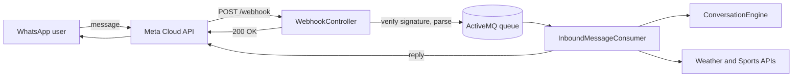

# NewsRoom

A WhatsApp bot that sends weather and football updates to anyone who chats with it. Message the bot, tap a button, and get your answer without installing an app or opening a website.

Built with Java 21, Javalin and ActiveMQ on the Meta WhatsApp Cloud API.

## What it does

| Option  | You send               | You get back                                                        |
|---------|------------------------|---------------------------------------------------------------------|
| Weather | A city name            | Temperature, conditions, wind speed and humidity (via Open-Meteo)   |
| Sports  | A league (button)      | Up to 5 recent results and 5 upcoming fixtures (via football-data.org) |
| News    | A topic                | *Coming soon*                                                       |

Supported leagues: Premier League, Champions League, La Liga.

## How it works



1. **Webhook:** Meta POSTs each inbound message to `/webhook`. The controller checks the `X-Hub-Signature-256` HMAC against the app secret, parses the message, puts it on the queue, and returns `200` right away. It never waits on reply logic, so Meta always gets a fast response.
2. **Queue:** ActiveMQ holds messages persistently between receiving and handling. If the broker is unreachable, the webhook returns `500` so Meta retries later instead of the message being lost.
3. **Consumer:** reads messages one at a time, looks up the user's conversation state, asks the engine what to do, runs any lookup, and sends the reply.
4. **Conversation engine:** a pure function from `(state, message)` to a `Decision` holding the next state, an optional reply and an optional lookup. It has no I/O, so every conversation path is unit-tested.

### Conversation flow

```
NONE ──(any message)──> AWAITING_OPTION ──Weather──> AWAITING_CITY   ──(city)───> NONE
                                        ──Sports───> AWAITING_LEAGUE ──(league)─> NONE
                                        ──News─────> AWAITING_TOPIC  ──(topic)──> NONE
```

Unexpected input, such as an image when a city was asked for or an old button, re-prompts for the same step. Sessions expire after 30 minutes of inactivity, so a user who stops halfway starts fresh next time.

### Reliability

- **Deduplication:** Meta retries and ActiveMQ redeliveries can deliver the same message twice. Each message is deduplicated by its WhatsApp message ID (`wamid`). An ID is only marked as processed after its message has been fully handled, so a redelivery that follows a real failure still goes through.
- **Acknowledge on success:** the consumer uses client acknowledgement. When handling fails, the session is recovered and the broker redelivers the message. After 6 failed attempts, the message moves to `ActiveMQ.DLQ`.
- **Send before saving state:** if a crash happens between the two steps, the redelivery sends the reply again rather than skipping it.
- **Lookup failures:** failures are split into `NOT_FOUND` (for example, a typo in a city name) and `UNAVAILABLE` (a timeout, bad status or malformed response). Each failure carries a friendly message for the user and a separate technical detail for the log.
- **Privacy in logs:** there is one log line per message, showing the ID, state transition, reply and lookup kind, and outcome. Phone numbers and message text are never logged.

## Project structure

```
src/main/java/com/newsroom/
├── NewsRoomServiceApp.java   # wiring and startup
├── config/                   # Config: env vars, fails fast on missing values
├── webhook/                  # WebhookController, WebhookParser, WebhookMessage
├── queue/                    # publisher, consumer, DedupeStore
├── session/                  # SessionStore, ConversationState
├── conversation/             # ConversationEngine, Decision, Reply, Lookup, ReplyFormatter
├── weather/                  # WeatherClient (Open-Meteo)
├── sports/                   # SportsClient (football-data.org)
└── whatsapp/                 # WhatsAppClient (outbound messages)
docs/privacy.html             # privacy policy required by Meta
```

## Getting started

### Prerequisites

- Java 21 and Maven
- Docker (to run ActiveMQ)
- [ngrok](https://ngrok.com/) with a static domain
- A Meta developer app with WhatsApp set up
- A [football-data.org](https://www.football-data.org/) API key (the free tier works)

### 1. Configure

```bash
cp .env.example .env
```

Fill in `.env`:

| Variable                  | Purpose                                                   |
|---------------------------|-----------------------------------------------------------|
| `PORT`                    | Port the app listens on (default `7000`)                  |
| `META_ACCESS_TOKEN`       | Token for calling the WhatsApp Cloud API                  |
| `META_PHONE_NUMBER_ID`    | WhatsApp Business phone number that messages are sent from |
| `WEBHOOK_VERIFY_TOKEN`    | Any string; also entered in the Meta dashboard            |
| `META_APP_SECRET`         | Used to verify webhook signatures                         |
| `ACTIVEMQ_BROKER_URL`     | Default `tcp://localhost:61616`                           |
| `ACTIVEMQ_BROKER_QUEUE`   | Default `inbound-message-queue`                           |
| `SESSION_TIMEOUT_MINUTES` | Default `30`                                              |
| `DEDUPE_WINDOW_MINUTES`   | Default `5`                                               |
| `FOOTBALL_DATA_API_KEY`   | football-data.org key                                     |
| `EXTERNAL_TIMEOUT_SECONDS`| Timeout for weather and sports calls (default `5`)        |

The app refuses to start if a required variable is missing and names which one.

### 2. Run

Set `NGROK_DOMAIN` at the top of `start.sh` to your own ngrok domain, then run:

```bash
./start.sh
```

This starts ActiveMQ in Docker, builds the jar, starts ngrok and the app, and waits until `/health` responds through the tunnel. Press `Ctrl+C` to stop everything.

### 3. Connect the webhook

In the Meta dashboard, under WhatsApp → Configuration:

- Set the callback URL to `https://<your-ngrok-domain>/webhook`.
- Set the verify token to the same value as `WEBHOOK_VERIFY_TOKEN`.
- Subscribe to the `messages` field.

Send the bot a message to test it.

## Testing

```bash
mvn test
```

The tests cover:

- **Conversation engine:** every state and message type, plus WhatsApp's button limits.
- **Parser:** text, button, image and status-only payloads, and malformed JSON.
- **API clients:** parsing is tested against fixtures captured from the real APIs. HTTP behaviour is tested against a local stub server that simulates errors, timeouts and unreachable hosts.
- **Session and dedupe stores:** expiry is tested with an injected clock, so tests move time forward instead of sleeping.

## Future changes

- **News lookups:** connect a news API so the News option returns real headlines.
- **Persistent state:** move sessions and dedupe records into Redis. State would then survive restarts and the app could run as more than one instance.
- **Retry failed sends:** make a failed WhatsApp send go through the same redelivery path as other failures.
- **Local kickoff times:** show fixtures in the user's timezone instead of UTC.
- **More leagues:** switch the league picker to a WhatsApp list message, which allows more than 3 options.
- **Batched webhooks:** handle every message in a webhook payload, not just the first.
- **Deployment:** host it permanently instead of running it locally behind ngrok.

## Privacy

See [`docs/privacy.html`](docs/privacy.html).

WTC-QCKHHC96